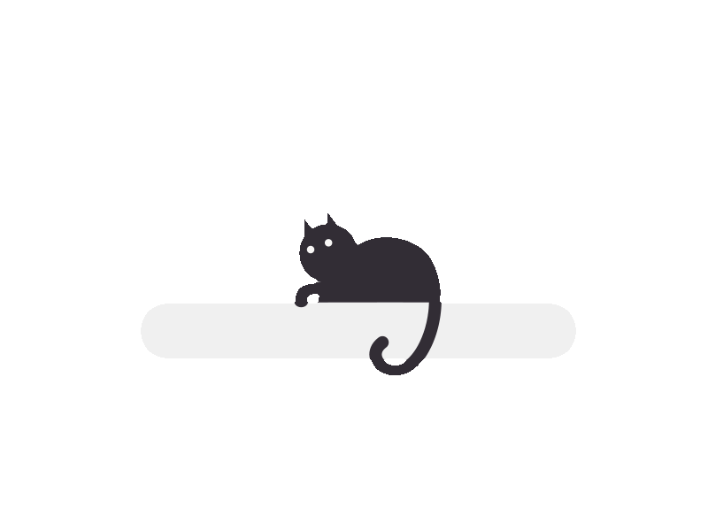
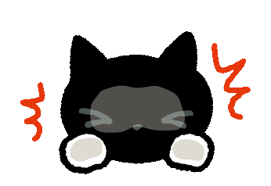

<!-- 13 17 23 -->
<!-- Profile Banner -->

  

<!-- Metrics: views/stars/followers -->
 
 

 

**Who Am I?**

I'm Arshane aka Aicee, a student at Cebu Technological University pursuing a Bachelor of Science in Information Technology. My journey into tech is driven by curiosity and creativity — I enjoy building websites and applications while exploring how aesthetics, logic, and functionality come together.

I’ve worked on projects such as a credit-based digital product trading marketplace, where I handled tasks across the full development stack — from planning and database design to backend logic and user-facing interfaces. I identify as a Full Stack Developer, capable of handling both front-end and back-end development, with a focus on building complete, functional, and user-centered systems.
 ㅤ
 

<!-- About me section -->

<!-- Gif on the right side -->
 

<!-- Simple description -->
 <h3 align="center">
  A Little More About Me
 </h3>

⬜ Currently working on cross-platform applications and management systems. 
⬜ Experienced in building full stack solutions, from system planning to deployment. 
⬜ Comfortable working with modern frameworks, databases, and backend logic. 
⬜ Motivated by complex projects that push both technical and creative boundaries. 
⬜ Open to collaboration and knowledge-sharing within development teams. 
 
 
 

<!-- My Stacks -->
<!-- Title -->
<h3 align="center">
<b>My Tech Stack </b>
</h3>

     
     

 

<!-- Achievements (optional)
<h3 align="center">My Achievements</h3>

  

-->

<!-- Footer wave -->

  

